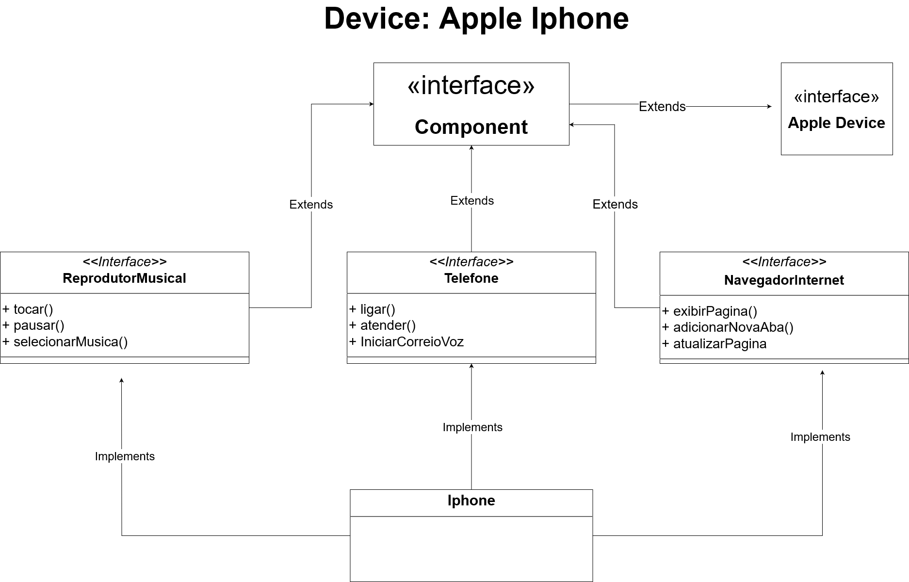

# apple-device-diagram-class-java

Este é um projeto simples em Java que simula a funcionalidade de um iPhone. Ele inclui interfaces e classes para representar diversas funcionalidades do iPhone.

## Descrição do Projeto

O projeto tem como objetivo demonstrar o conceito de interfaces e classes em Java ao modelar um iPhone com três funcionalidades principais: Reprodutor de Música, Telefone e Navegador de Internet. Ele mostra como essas funcionalidades podem ser organizadas usando interfaces e implementadas na classe `Iphone`.

## Tecnologias Utilizadas

- Linguagem de Programação: Java

## Como Usar

1. Clone o repositório para a sua máquina local.
2. Abra o projeto no seu ambiente de desenvolvimento Java (por exemplo, Eclipse, IntelliJ IDEA).
3. Compile e execute a classe `Main` para ver a simulação do iPhone em ação.

Exemplo:

```shell
$ java Main



Este diagrama de classes UML ilustra a hierarquia de classes do projeto e os relacionamentos entre as interfaces e as classes.
